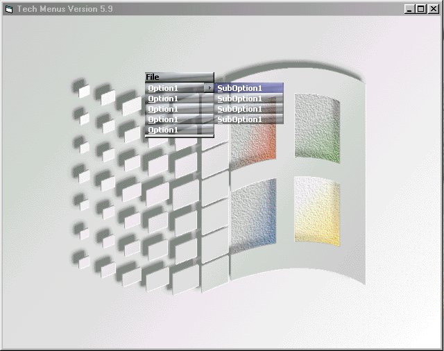

<div align="center">

## Tech Menus 5\.9


</div>

### Description

menu system
 
### More Info
 
menu details

gona find some bugs i bet

menu

none so far


<span>             |<span>
---                |---
**Submitted On**   |2000-07-28 22:02:14
**By**             |[lewis Wilson](https://github.com/Planet-Source-Code/PSCIndex/blob/master/ByAuthor/lewis-wilson.md)
**Level**          |Advanced
**User Rating**    |5.0 (35 globes from 7 users)
**Compatibility**  |VB 5\.0, VB 6\.0
**Category**       |[Custom Controls/ Forms/  Menus](https://github.com/Planet-Source-Code/PSCIndex/blob/master/ByCategory/custom-controls-forms-menus__1-4.md)
**World**          |[Visual Basic](https://github.com/Planet-Source-Code/PSCIndex/blob/master/ByWorld/visual-basic.md)
**Archive File**   |[CODE\_UPLOAD83247292000\.zip](https://github.com/Planet-Source-Code/lewis-wilson-tech-menus-5-9__1-8468/archive/master.zip)

### API Declarations

```
#include "windows.h"
:>
```


